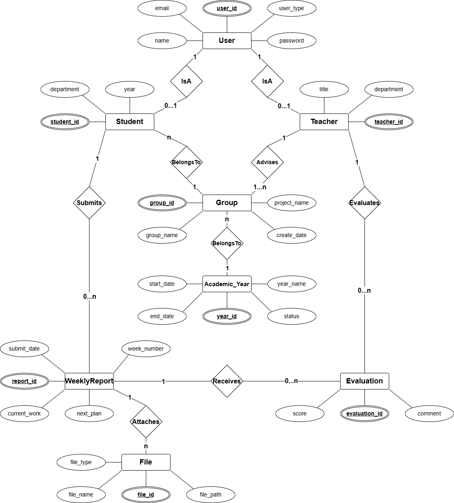
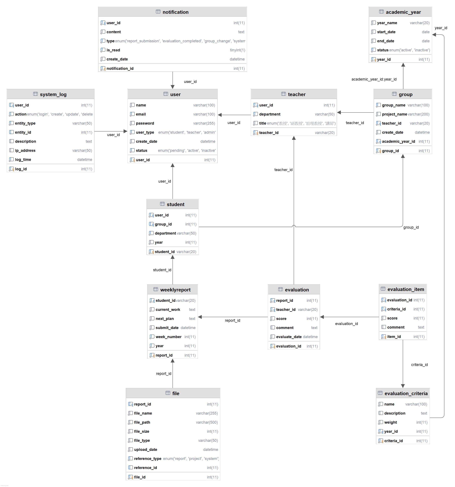

  <h1>🎯 專題進度追蹤系統</h1>
  
  
  
  
  
  
  
  

## ✨ 系統概述
專題進度追蹤系統是一個多用戶網頁應用平台，旨在幫助教師有效地追蹤和記錄學生的專題進展。
 
系統支持三種用戶角色（學生、教師和管理員），提供專題管理、進度追蹤、評分回饋和記錄查看等功能。

## 👥 系統角色與架構概述

專題進度追蹤系統基於角色分層的設計理念，確保各類用戶能有效率地完成其在專題管理流程中的責任，同時維持整體系統的安全性與可用性。

### 角色分層與權限設計

系統採用三層角色架構，形成專題管理的完整生態：

| 角色 | 系統定位 | 主要職責 | 權限範圍 |
|:------:|:----------:|:----------:|:----------:|
| **👨‍🎓 學生** | 內容生產者 | 執行專題開發、提交進度 | 侷限於個人與所屬組別 |
| **👨‍🏫 教師** | 審核評估者 | 指導專題方向、評估成果 | 限於所指導的學生與組別 |
| **👨‍💼 管理員** | 系統維護者 | 維護系統運作、管理用戶 | 全系統範圍的管理權限 |

### 資料流與角色互動

專題管理生命週期中的資料流動與角色互動：

```mermaid
graph LR
    A[學生] -->|提交週報| B[系統]
    B -->|通知| C[教師]
    C -->|評分與回饋| A
```

- **🔍 專題初始階段**：管理員分配學生至適當教師，教師建立專題組別
- **📝 專題進行階段**：學生定期提交週報，教師評閱並提供回饋
- **⚙️ 專題調整階段**：根據進展，教師可調整組別配置，管理員處理特殊情況
- **📊 專題結束階段**：系統保存所有記錄，供未來參考與評估

## 📝 應用情境與使用案例

### 情境一：學生週報繳交與進度追蹤

**參與者**：資工系大三學生

**情境描述**：
某資工系大三學生，正在進行畢業專題。每週五是他們小組繳交週報的截止日。今天是週四晚上，學生需要提交本週的進度報告。

**使用案例**：
1. 學生登入系統進入「進度繳交」頁面
2. 系統顯示表單，包含「本週進度報告」與「下週工作計畫」欄位
3. 學生填寫本週已完成的程式模組測試結果，並上傳測試程式碼檔案
4. 學生填寫下週將進行系統整合測試的計畫
5. 學生提交週報，系統記錄提交時間
6. 系統通知學生週報提交成功，可在「瀏覽模式」查看
7. 學生進入「瀏覽模式」，透過日曆界面查看本週的提交記錄
8. 學生查看上週填寫的「下週工作計畫」與本週實際完成的工作，進行自我檢視

### 情境二：教師評閱週報與提供回饋

**參與者**：資工系教授

**情境描述**：
教授指導多組畢業專題，每週需要審閱學生提交的週報並給予回饋。週報截止日的隔天（週六），教授安排時間檢視並評分各組的週報。

**使用案例**：
1. 教授登入系統後，進入「進度評分」頁面
2. 系統顯示日曆視圖，標記出已有學生提交週報的日期
3. 教授點選昨天（週五）的日期，系統顯示所有已提交週報的組別
4. 教授選擇「智慧家居系統」專題組，查看該組所有成員的週報
5. 系統顯示該組每位成員的週報內容、上傳檔案及歷史進度比對
6. 教授發現學生的程式測試方法有改進空間，於評論區提供具體建議
7. 教授為學生的週報評分並提交，系統記錄評分時間
8. 教授繼續評閱其他組員的週報，完成本週所有評分工作
9. 教授進入「組別管理」，根據週報表現調整某些學生的分組

### 情境三：系統管理與專題分配調整

**參與者**：系統管理員 - 管理員

**情境描述**：
新學年開始，專題指導老師選擇時間已截止，同時系上來了新教授和轉學生。此外，系主任需要查看上一學年度的所有專題記錄作為參考。管理員需要處理這些系統管理任務。

**使用案例**：
1. 管理員登入系統，進入「審核介面」頁面
2. 系統顯示待審核的新用戶申請列表，包含新教授和轉學生
3. 管理員審核新進教授的帳號申請，並分配教師權限
4. 管理員審核轉學生的帳號申請，並分配學生權限
5. 審核完成後，管理員進入學生「組別管理」頁面
6. 根據學生的專長和老師需求，管理員調整部分學生的專題組別分配
7. 管理員確認每個專題組別的人數平衡
8. 接著，管理員進入「統計功能」頁面
9. 管理員選擇上一學年度的時間範圍，查詢所有專題記錄
10. 系統生成視覺化報表，顯示各組學生的進度完成情況與評分情況
11. 管理員匯出這些統計數據，準備提供給系主任作為本學年度專題規劃參考

## 🖥️ 系統需求說明

### 功能需求

<table>
  <tr>
    <th>功能類別</th>
    <th>功能描述</th>
  </tr>
  <tr>
    <td><b>📊 用戶管理</b></td>
    <td>
      • <b>註冊與登入</b>：所有用戶需要註冊帳號並登入系統才能使用功能 
      • <b>權限管理</b>：系統需區分學生、教師和管理員三種權限 
      • <b>帳號審核</b>：新用戶註冊須經管理員審核後方可使用 
      • <b>密碼管理</b>：提供密碼重設和修改功能
    </td>
  </tr>
  <tr>
    <td><b>👨‍🎓 學生功能</b></td>
    <td>
      • <b>個人資料管理</b>：查看個人基本資料 
      • <b>週報提交</b>：填寫本周專題報告項目和下周工作計畫 
      • <b>檔案上傳</b>：上傳專題相關檔案（設計圖、程式碼、文件等） 
      • <b>進度查詢</b>：以日曆方式查看自己和組員的週報提交情況 
      • <b>回饋查看</b>：查看教師對週報的評語和評分
    </td>
  </tr>
  <tr>
    <td><b>👨‍🏫 教師功能</b></td>
    <td>
      • <b>組別管理</b>：建立、編輯專題組別，分配和調整組員 
      • <b>進度評核</b>：查看、評分學生提交的週報，提供評語 
      • <b>評分記錄</b>：查看過去的評分的紀錄 
      • <b>歷年專題查詢</b>：查看負責的學生過往學年的專題資料
    </td>
  </tr>
  <tr>
    <td><b>👨‍💼 管理員功能</b></td>
    <td>
      • <b>用戶審核</b>：審核新用戶註冊申請，分配適當權限 
      • <b>用戶調整</b>：根據需求調整學生所屬的教授和實驗室 
      • <b>檔案管理</b>：查看往年所有學生的專題 
      • <b>系統監控</b>：監控系統運作狀況，查看系統日誌
    </td>
  </tr>
  <tr>
    <td><b>🔄 系統共通功能</b></td>
    <td>
      • <b>日曆視圖</b>：以日曆形式顯示週報提交與評分情況 
      • <b>檔案管理</b>：支援多種格式檔案上傳、下載與預覽 
      • <b>搜尋功能</b>：按年份、組別、關鍵字等條件搜尋專題資料 
      • <b>通知功能</b>：週報提交、評分完成等事件的通知提醒
    </td>
  </tr>
</table>

## 📊 資料庫設計

本系統資料庫包含 12 個主要表格，涵蓋用戶管理、專題組別、週報提交和評分等所有功能。資料表之間的關聯設計確保了資料的完整性和一致性。

### 實體關係圖 (ER Diagram)

此 ER Diagram 展示了系統中各實體之間的關係，包括學生、教師、組別、週報等核心概念之間的關聯和基數限制。

### 資料庫結構圖 (Schema Diagram)

Schema Diagram 展示了實際資料庫表格之間的關聯結構，包括外鍵關係和表格欄位的概覽。

### 資料庫安全與權限管理

本系統實施了嚴格的資料庫使用者權限控制，確保符合最小權限原則：

| 資料庫角色 | 用途 | 權限等級 |
|:------------:|:------:|:-------:|
| 🔑 **管理員角色** | 系統維護與用戶管理 | 完整管理權限 |
| 🔌 **應用程式角色** | 系統運行基礎連接 | 受控讀寫權限 |
| 📝 **教師角色** | 評分與組別管理操作 | 限定讀寫權限 |
| 📤 **學生角色** | 週報提交與檔案上傳 | 高度受限權限 |
| 💾 **備份角色** | 系統備份操作 | 唯讀權限 |
| 📈 **報表角色** | 統計與分析功能 | 唯讀與分析權限 |

透過預存程序與視圖實現更細緻的權限控制，確保使用者只能訪問與其角色相關的資料。
 
詳細的權限設定與實施方法請參閱「資料庫細節文檔」。

### 詳細資料庫定義

完整的資料庫結構、SQL 定義語句和完整性限制詳情：[點擊查看詳細資料庫設計](docs/database/database-details.md)

## 🔄 ACID特性在專題系統中的應用

本專題系統涉及多種需要ACID特性保障的關鍵操作：

<table>
  <tr>
    <th width="25%">系統操作</th>
    <th>ACID應用說明</th>
  </tr>
  <tr>
    <td><b>📝 週報提交</b></td>
    <td>
      <b>A</b>：週報內容和附件檔案必須同時成功儲存或同時失敗 
      <b>C</b>：確保週報關聯到有效的學生，檔案關聯到有效的週報 
      <b>I</b>：多位學生同時提交週報時不互相干擾 
      <b>D</b>：一旦提交成功，週報資料會被永久儲存
    </td>
  </tr>
  <tr>
    <td><b>⭐ 週報評分</b></td>
    <td>
      <b>A</b>：評分和評語必須同時成功記錄或同時失敗 
      <b>C</b>：確保評分教師有權限對該週報進行評分 
      <b>I</b>：多位教師同時評分不同週報時不互相干擾 
      <b>D</b>：一旦評分成功，評分資料會被永久儲存
    </td>
  </tr>
  <tr>
    <td><b>👥 組別調整</b></td>
    <td>
      <b>A</b>：學生組別變更必須完整進行，包括舊組關聯解除和新組關聯建立 
      <b>C</b>：確保變更後的組別仍然符合業務規則 
      <b>I</b>：同時變更多位學生組別時不會產生衝突 
      <b>D</b>：一旦變更成功，新的組別關係會被永久儲存
    </td>
  </tr>
  <tr>
    <td><b>👤 用戶註冊審核</b></td>
    <td>
      <b>A</b>：用戶權限分配和狀態變更必須同時完成 
      <b>C</b>：確保用戶資料符合完整性限制 
      <b>I</b>：多個管理員同時審核不同用戶時不互相干擾 
      <b>D</b>：一旦審核通過，用戶狀態變更會被永久儲存
    </td>
  </tr>
</table>

## 🛠️ 開發技術與工具

### 使用語言
- **後端**：Java 17 / PHP 8.1 (測試評估中)
- **前端**：HTML5, CSS3, JavaScript (ES6+)
- **資料庫**：SQL (MariaDB 10.6)

### 開發工具
- **IDE**：
  - IntelliJ IDEA 2023.1 (Java 後端開發)
  - PhpStorm 2023.1 (PHP 後端開發)
  - WebStorm 2023.1 (前端開發)
- **資料庫管理**：DataGrip 2023.1, phpMyAdmin
- **版本控制**：Git, GitHub
- **API 測試**：Postman
- **前端框架**：React, Bootstrap 5
- **後端框架**：Spring Boot 3.0 / Laravel 9 (測試評估中)

### 使用技術
- **認證**：JWT (JSON Web Tokens)
- **API**：RESTful API
- **資料交換**：JSON
- **前後端分離**：Axios 用於前端 API 請求
- **資料庫存取**：JPA (Java) / Eloquent ORM (PHP)

## 📋 專案進度

| 階段 | 說明 | 負責人員 | 狀態 |
|------|------|---------|------|
| **規劃階段** | | | |
| 需求分析 | 界定系統功能需求和非功能需求 | 陳廷威 | ✅ 已完成 |
| 應用情境設計 | 撰寫使用案例和情境描述 | 陳廷威 | ✅ 已完成 |
| **設計階段** | | | |
| 系統架構設計 | 設計系統整體架構和組件關係 | 陳廷威 | ✅ 已完成 |
| 資料庫設計 | 設計 ER Diagram 和詳細資料表結構 | 陳廷威 | ✅ 已完成 |
| 使用者介面設計 | 設計各角色的使用者介面和互動流程 | 陳廷威 | ✅ 已完成 |
| **開發階段** | | | |
| 資料庫實作 | 建立資料庫並實作完整性限制 | 陳廷威 | ✅ 已完成 |
| 使用者權限管理 | 實作資料庫使用者與權限控制 | 陳廷威 | ✅ 已完成 |
| 後端框架評估 | 評估 Spring Boot 與 PHP 框架的適用性 | 陳廷威 | ⚠️ 進行中 |
| 後端 API 開發 | 實作 RESTful API 和業務邏輯 | 陳廷威 | ⚠️ 進行中 |
| 前端頁面開發 | 實作使用者介面和前後端整合 | 陳廷威 | 🕒 待開始 |
| **測試階段** | | | |
| 單元測試 | 對關鍵功能進行單元測試 | 陳廷威 | 🕒 待開始 |
| 整合測試 | 測試前後端整合和系統功能 | 陳廷威 | 🕒 待開始 |
| 壓力測試 | 測試系統在高負載下的表現 | 陳廷威 | 🕒 待開始 |
| **部署階段** | | | |
| 系統部署 | 將系統部署到正式環境 | 陳廷威 | 🕒 待開始 |
| 使用者培訓 | 培訓系統使用者和維護人員 | 陳廷威 | 🕒 待開始 |

## 🎯 Final Project 完成進度

### Part I（已完成）
- ✅ 題目定義
- ✅ 應用情境與使用案例
- ✅ 系統需求說明
- ✅ 完整性限制
- ✅ ER Diagram 及詳細說明

### Part II（已完成）
- ✅ 修正系統需求說明
- ✅ 修正 ER Diagram 與說明
- ✅ 完整資料庫 Schema（SQL 語法）
- ✅ 範例資料說明
- ✅ 資料庫使用者與權限設計

### Part III（待開始）

## 👨‍💻 開發者

  

### 陳廷威 40943212

我是「專題進度追蹤系統」的開發者，致力於資料庫設計與實作、系統架構規劃及前後端整合。
 
正在對於資料庫正規化設計與ACID特性實踐方面進行深入研究。

#### 🧰 技術棧

**資料庫技術**

**後端/前端技術**

**開發工具**

#### 🔗 聯絡方式

<!-- LINK GROUP -->

[project-url]: https://github.com/TingWei-Chen/DataBase_Project "專題進度追蹤系統"
